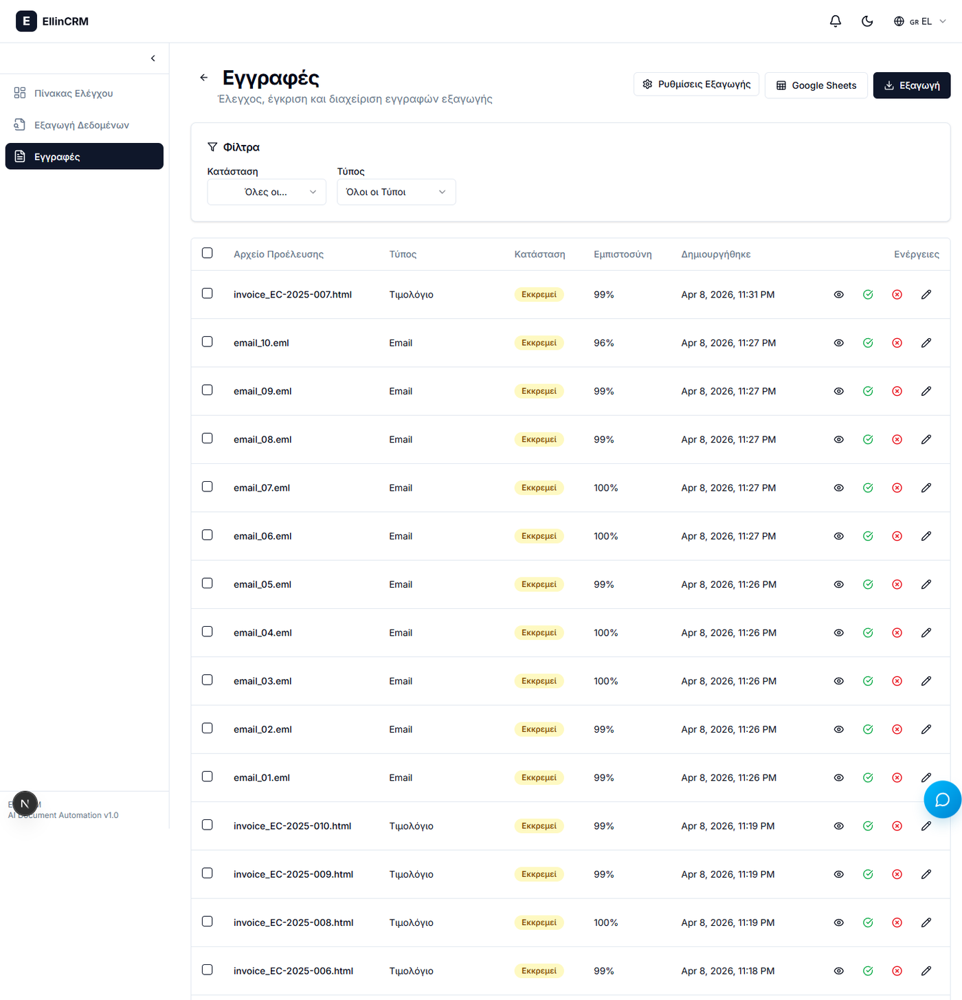
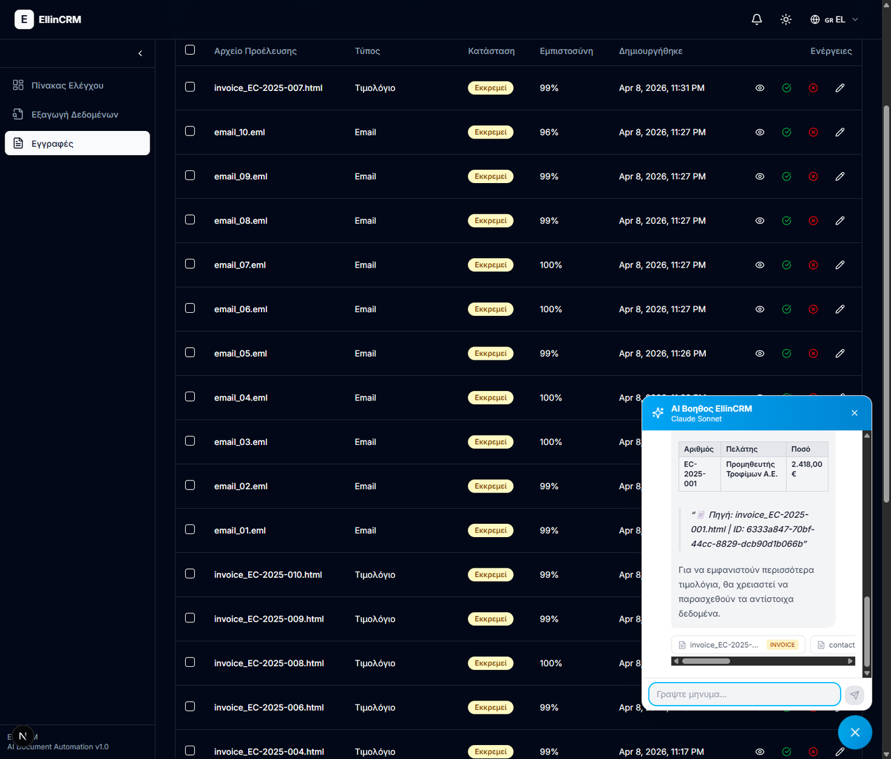

# EllinCRM

> AI-powered document automation platform for Greek businesses — built to showcase production-grade AI engineering for automation services clients.

EllinCRM extracts structured data from forms, emails, and invoices using LLM-based extraction with per-field confidence scores, stores it with vector embeddings for hybrid semantic + keyword search, and provides a streaming AI chat agent that answers business questions in Greek with source citations — all under a human-in-the-loop approval workflow.



> The records dashboard — forms, emails, and invoices side by side, with per-field confidence rings and one-click approve / edit / reject. Each extraction carries its source file and an audit trail.



> The chat agent answering a Greek business question by calling structured tools, running hybrid retrieval over the records, and citing every source record it used. Tokens stream in live over SSE.

---

## Highlights

- **Multi-model LLM router** — Gemini 3.1 Flash for extraction, Claude Sonnet 4.6 for chat, Claude Haiku 4.5 as fallback, all behind a single abstraction with automatic retry chains
- **Local-first embeddings** — EmbeddingGemma 300M runs on the server (768-dim, multilingual). Document content embeddings never leave your infrastructure
- **Hybrid retrieval** — pgvector cosine similarity (0.7) + PostgreSQL `tsvector` keyword match (0.3), with Greek accent normalization and stopword filtering
- **Streaming RAG chat** — SSE-based token streaming with in-line source citations (record ID + source file)
- **Human-in-the-loop** — Every extraction is reviewable, editable, approvable, and rejectable. Full audit trail in PostgreSQL
- **Premium UI** — Next.js 16 + React 19 + TailwindCSS v4 + shadcn/ui + Framer Motion. Dark mode, animated confidence rings, split-screen review, drag-and-drop upload, demo mode
- **Google Sheets sync** — Approved records auto-sync to Sheets with per-type tabs

---

## Architecture

```
┌──────────────────────────────────────────────────────────────────┐
│                         Next.js 16 Frontend                       │
│      Dashboard · Records · Extraction · Streaming Chat Widget     │
└────────────────────────────┬─────────────────────────────────────┘
                             │ HTTP / SSE / WebSocket
┌────────────────────────────▼─────────────────────────────────────┐
│                      FastAPI Backend (Python 3.13)                │
│  ┌─────────────┐  ┌─────────────┐  ┌──────────────────────────┐  │
│  │ Extraction  │  │   Records   │  │       Chat (RAG)         │  │
│  │   Router    │  │   Router    │  │   SSE Streaming Router   │  │
│  └──────┬──────┘  └──────┬──────┘  └────────────┬─────────────┘  │
│         │                │                       │                │
│  ┌──────▼────────────────▼───────────────────────▼─────────────┐ │
│  │              LiteLLM Router (Multi-Model Abstraction)        │ │
│  │   gemini-flash · claude-sonnet · claude-haiku                │ │
│  └─────────────────────────┬─────────────────────────────────────┘│
│                            │                                      │
│  ┌─────────────────────────▼─────────────────────────────────────┐│
│  │  EmbeddingGemma 300M  ·  Hybrid Search  ·  Greek NLP         ││
│  └─────────────────────────┬─────────────────────────────────────┘│
└────────────────────────────┼──────────────────────────────────────┘
                             │
                  ┌──────────▼──────────┐
                  │  PostgreSQL 18 +    │
                  │     pgvector        │
                  └─────────────────────┘
```

### Tech stack

| Layer        | Technology                                                                  |
|--------------|-----------------------------------------------------------------------------|
| Backend      | FastAPI (async), Python 3.13, SQLAlchemy 2.1, Pydantic 2.12, Alembic        |
| Frontend     | Next.js 16, React 19, TypeScript, TailwindCSS v4, shadcn/ui, Framer Motion |
| Database     | PostgreSQL 18 with pgvector                                                 |
| Embeddings   | EmbeddingGemma 300M via sentence-transformers (local, multilingual)         |
| LLM Router   | LiteLLM 1.81+                                                               |
| LLMs         | Gemini 3.1 Flash, Claude Sonnet 4.6, Claude Haiku 4.5                       |
| State (FE)   | TanStack Query 5                                                            |
| i18n         | next-intl (Greek + English)                                                 |
| Containers   | Docker Compose v2                                                           |

---

## Getting started

### Prerequisites

- Docker Desktop (or Docker Engine + Compose v2)
- A Google AI Studio API key (for Gemini)
- An Anthropic API key (for Claude)
- *Optional:* HuggingFace token for the gated `embeddinggemma` model — falls back to a free multilingual model otherwise

### 1. Clone and configure

```bash
git clone https://github.com/Chariton-kyp/EllinCRM.git
cd EllinCRM

# Backend env
cp backend/.env.example backend/.env
# Edit backend/.env and add: GOOGLE_API_KEY, ANTHROPIC_API_KEY, HUGGINGFACE_TOKEN (optional)

# Frontend env
cp frontend/.env.example frontend/.env.local
```

### 2. Run (development with hot reload)

```bash
docker compose --profile dev up --build
```

| Service          | URL                              |
|------------------|----------------------------------|
| Frontend         | http://localhost:7002            |
| Backend API      | http://localhost:7000            |
| Backend docs     | http://localhost:7000/docs       |
| PostgreSQL       | localhost:7001                   |

### 3. Run tests

```bash
docker compose --profile test run --rm test
```

### 4. Production build

```bash
docker compose --profile prod up --build -d
```

---

## Project layout

```
EllinCRM/
├── backend/              # FastAPI service
│   ├── app/
│   │   ├── ai/           # EmbeddingGemma, hybrid search, Greek NLP, LiteLLM router
│   │   ├── extractors/   # HTML/EML regex extractors (LLM fallback)
│   │   ├── routers/      # extraction · records · search · chat · notifications
│   │   ├── services/     # llm_extractor · rag_service · export · google_sheets
│   │   ├── db/           # SQLAlchemy models, repositories
│   │   └── core/         # config, logging, runtime settings
│   ├── alembic/          # Database migrations
│   └── tests/
├── frontend/             # Next.js 16 dashboard
│   ├── app/              # App Router pages
│   ├── components/       # UI: chat · dashboard · extraction · records · export
│   └── lib/              # API clients, hooks, utilities
├── dummy_data/           # 25 sample Greek business documents (forms, emails, invoices)
├── docs/                 # Setup guides (Greek)
├── docker-compose.yml
└── README.md
```

---

## Sample dummy data

EllinCRM ships with 25 realistic Greek business documents across 7 industries:

- Restaurant (Ταβέρνα "Ο Παράδεισος")
- Law firm (Δικηγορικό Γραφείο Παπαδόπουλος & Συνεργάτες)
- Accounting firm (Λογιστικό Γραφείο Οικονομίδης)
- Electronics retailer (TechnoShop)
- Construction company (ΕλληνΚατασκευές ΑΕ)
- Medical clinic (Ιατρικό Κέντρο "Υγεία")
- Hotel (Ξενοδοχείο "Αιγαίο")

Use the **Demo Mode** button on the dashboard to ingest all 25 in one click.

---

## Privacy posture

- Embeddings are generated **on-server** by EmbeddingGemma — document content used for vector indexing never leaves your infrastructure
- Extraction and chat calls go to **cloud LLMs** (Gemini, Claude) — easily swappable for local models (Qwen, Mistral, Llama) on a sufficiently sized VPS
- Real `.env` and credential files are **gitignored** by default — only `.example` templates are tracked

---

## License

**Source-available for portfolio viewing only — not open source.**

This repository is published publicly as a **portfolio showcase** of the
author's work. You may read, study, and evaluate the code, but you may **not**
use it in any product, service, or business — commercial or otherwise — and
you may **not** redistribute, modify, or create derivative works without prior
written permission.

See [LICENSE.md](LICENSE.md) for the full terms. For commercial licensing
enquiries, contact <haritos19@gmail.com>.

---

## Author

**Chariton Kypraios** — AI Engineer, Athens
[LinkedIn](https://linkedin.com/in/chariton-kypraios) · [EllinAI](https://ellinai.com)

🤖 Built with [Claude Code](https://claude.com/claude-code)
